<!-- Automatically generated, do not change by hand. Use make.py instead. -->

# `mpljourney`: datasets for [matplotlib-journey.com](https://www.matplotlib-journey.com/)

`mpljourney` is a small package with datasets used in the [Matplotlib Journey online course](https://www.matplotlib-journey.com/).

The datasets are either pandas or geopandas dataframes. Geopandas dataframes are mainly used to provide polygons for drawing maps.

<br><br>

## Installation

```bash
pip install git+https://github.com/JosephBARBIERDARNAL/mpljourney.git
```

<br><br>

## All datasets


### accident-london


```py
from mpljourney import load_dataset

df = load_dataset("accident-london")
df.head(10)
```

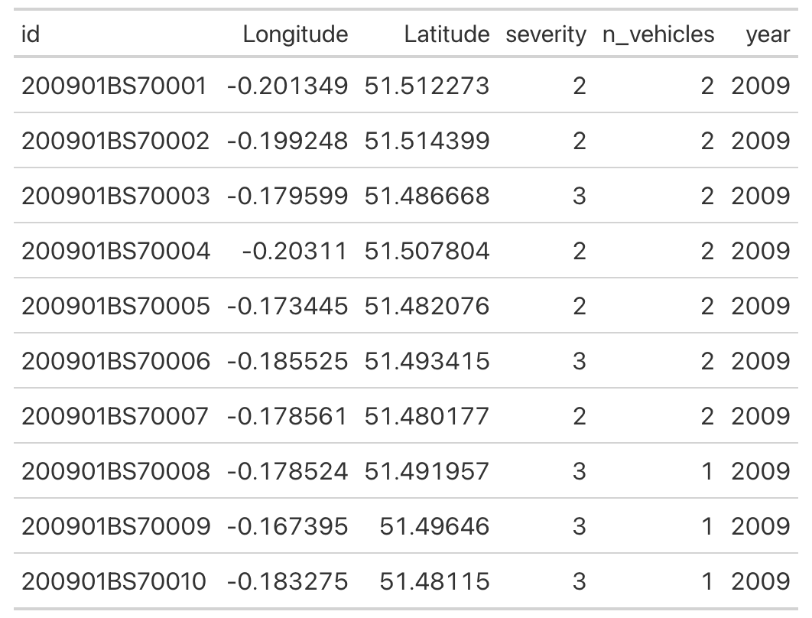

    

### CO2


```py
from mpljourney import load_dataset

df = load_dataset("CO2")
df.head(10)
```

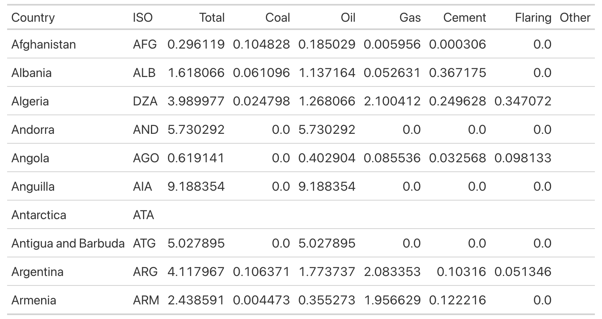

    

### earthquakes


```py
from mpljourney import load_dataset

df = load_dataset("earthquakes")
df.head(10)
```

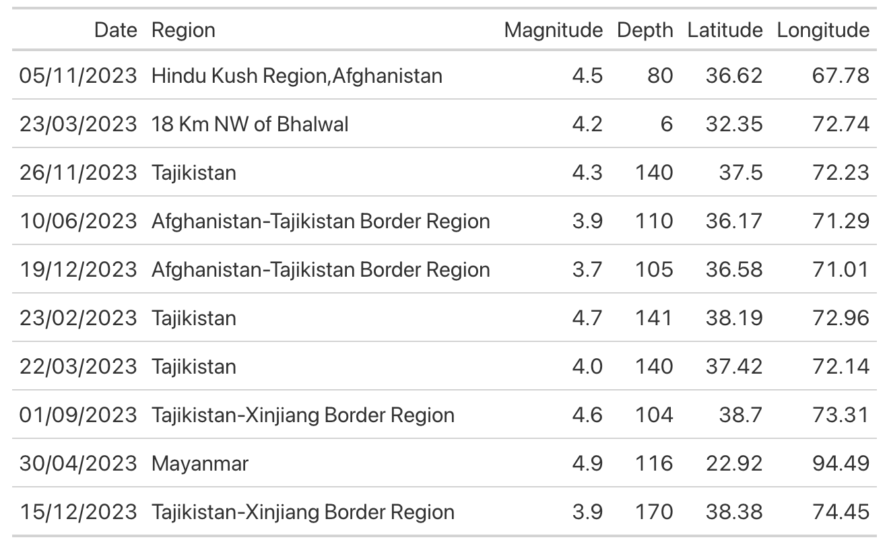

    

### economic


```py
from mpljourney import load_dataset

df = load_dataset("economic")
df.head(10)
```


    

### footprint


```py
from mpljourney import load_dataset

df = load_dataset("footprint")
df.head(10)
```

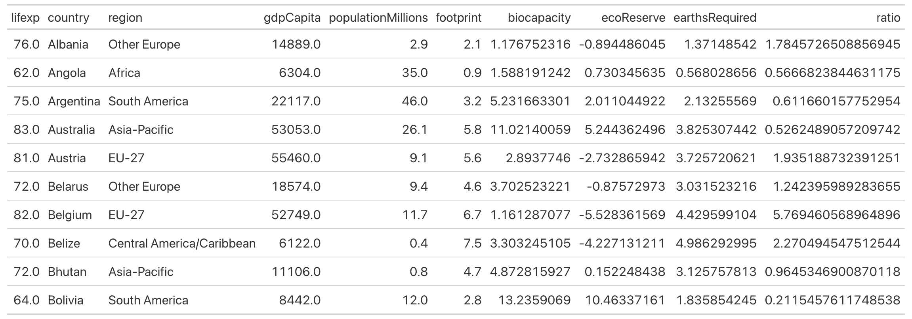

    

### game-sales


```py
from mpljourney import load_dataset

df = load_dataset("game-sales")
df.head(10)
```

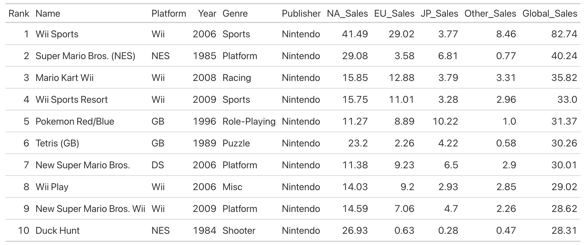

    

### london

The `geometry` column with the polygons is hidden.

```py
from mpljourney import load_dataset

df = load_dataset("london")
df.head(10)
```


    

### mariokart


```py
from mpljourney import load_dataset

df = load_dataset("mariokart")
df.head(10)
```

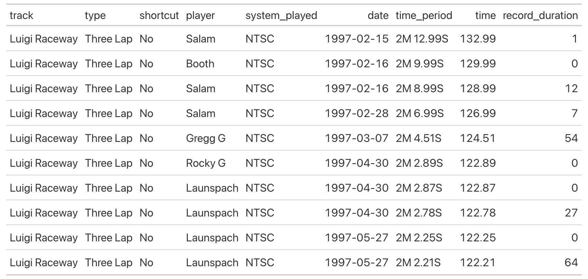

    

### natural-disasters


```py
from mpljourney import load_dataset

df = load_dataset("natural-disasters")
df.head(10)
```

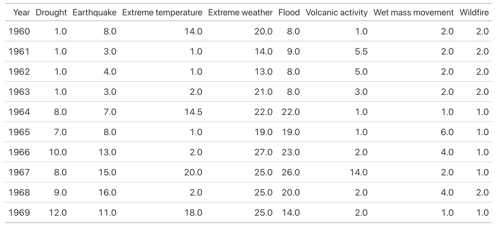

    

### netflix


```py
from mpljourney import load_dataset

df = load_dataset("netflix")
df.head(10)
```


    

### newyork-airbnb


```py
from mpljourney import load_dataset

df = load_dataset("newyork-airbnb")
df.head(10)
```

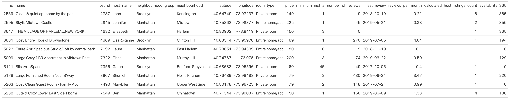

    

### newyork

The `geometry` column with the polygons is hidden.

```py
from mpljourney import load_dataset

df = load_dataset("newyork")
df.head(10)
```

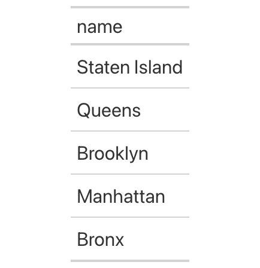

    

### storms


```py
from mpljourney import load_dataset

df = load_dataset("storms")
df.head(10)
```

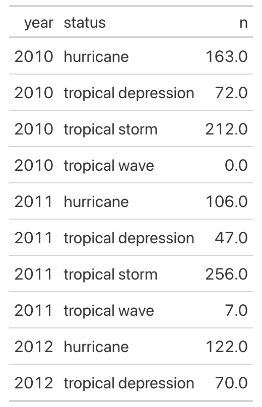

    

### ufo


```py
from mpljourney import load_dataset

df = load_dataset("ufo")
df.head(10)
```

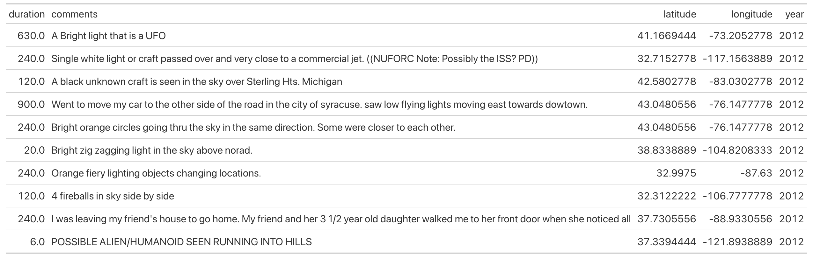

    

### us-counties

The `geometry` column with the polygons is hidden.

```py
from mpljourney import load_dataset

df = load_dataset("us-counties")
df.head(10)
```

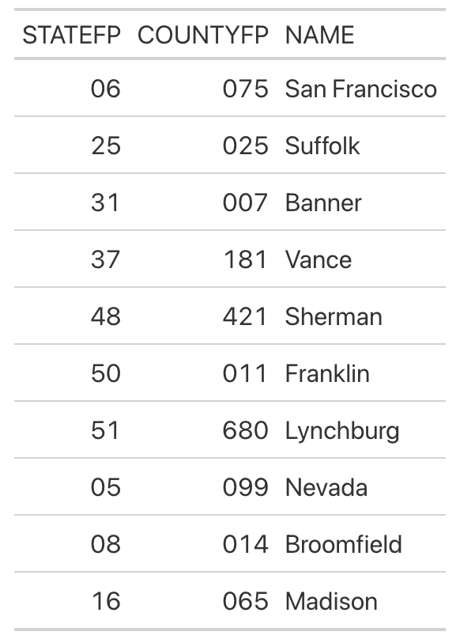

    

### walks


```py
from mpljourney import load_dataset

df = load_dataset("walks")
df.head(10)
```

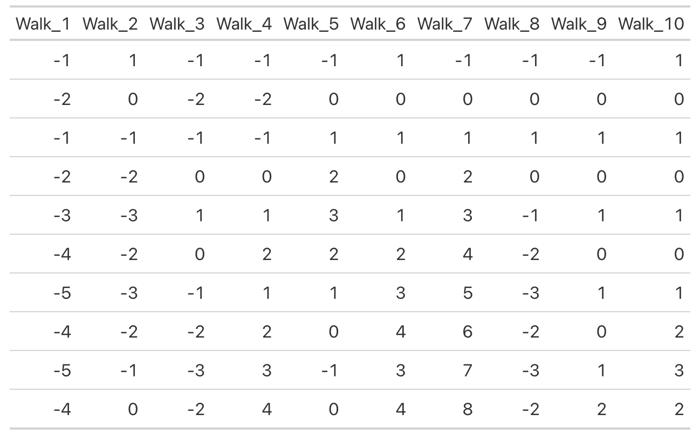

    

### wine


```py
from mpljourney import load_dataset

df = load_dataset("wine")
df.head(10)
```

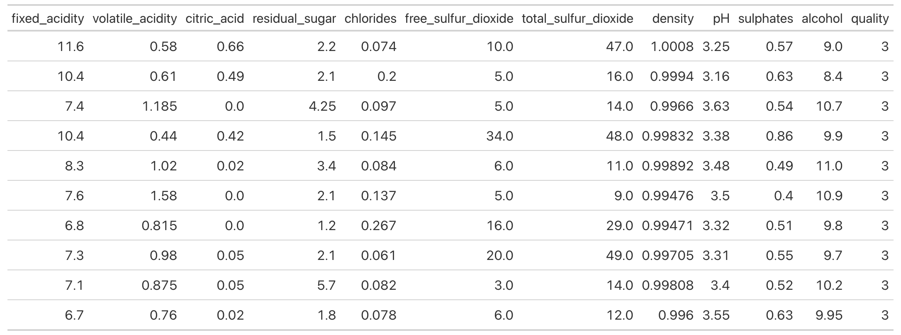

    

### world

The `geometry` column with the polygons is hidden.

```py
from mpljourney import load_dataset

df = load_dataset("world")
df.head(10)
```

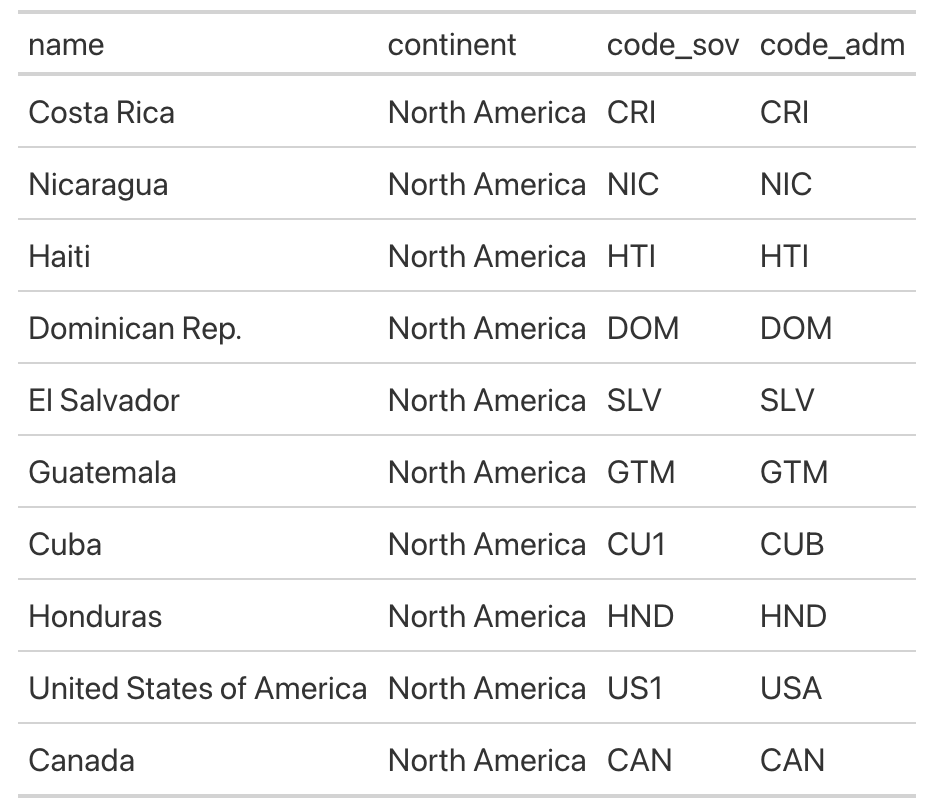

    